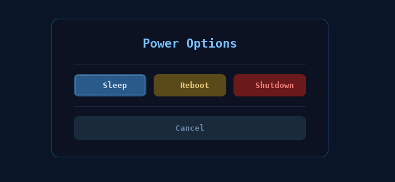

# Minimal Sway Setup for Debian 13+
## Optimized for Intel i5-6500T (HD 530 iGPU)

A complete, minimal Wayland/Sway installation focused on performance and efficiency. Targets **<200MB idle RAM** with tear-free Intel HD 530 graphics acceleration.

---

## What's Included

### Core Components
- **Sway** - Tiling Wayland compositor (i3-compatible)
- **Waybar** - Lightweight status bar with clock, calendar popup, and power button
- **Foot** - Fast, minimal terminal emulator
- **Rofi** - Application launcher with custom midnight theme
- **Sway Notification Center** - Modern notification daemon
- **PipeWire** - Modern audio stack (lower CPU than PulseAudio)

### Custom Applications
Three Python GTK3 apps are included in `~/.local/bin/`, all styled with the midnight dark theme:

- **`sway-welcome`** — Welcome screen shown on first login. Lists key keybindings, links to GitHub and sponsor page, and has a "Don't show again" checkbox. Run with `--force` to show it at any time.
- **`sway-power`** — Power menu (`$mod+Shift+p` or waybar ⏻ button). Sleep calls `systemctl suspend` directly (logind allows it without auth). Reboot and Shutdown prompt for your sudo password.
- **`cal-popup`** — GTK calendar popup launched by clicking the waybar clock. Closes on focus-out or Escape. Wrapped by `cal-toggle` which prevents duplicate windows.

### System Tools
- **PCManFM** - Lightweight file manager
- **Pavucontrol** - Audio mixer GUI
- **Grim + Slurp** - Screenshot tools
- **Brightnessctl** - Backlight control
- **LXAppearance** - GTK theme manager
- **Cliphist + wl-copy** - Clipboard history manager (`$mod+v`)
- **Arc-Dark GTK theme + Papirus icons** - Applied system-wide
- **Wlsunset** - Night light (adjustable latitude/longitude)

### Intel HD 530 Optimizations
- Mesa Vulkan drivers
- VAAPI hardware video acceleration
- Intel media driver (non-free)
- Optimized i915 kernel parameters
- Power management tuning

### Gaming Support (Optional)
- **GameMode** - CPU/GPU governor optimization
- **MangoHud** - Performance overlay
- **GameScope** - Micro-compositor for games
- **Steam** libraries (multilib i386 support)
- **VkBasalt** - Vulkan post-processing

---

## Screenshots

### Desktop
<!-- Add desktop screenshot here -->


### Waybar
<!-- Add waybar screenshot here -->


### Sway-Power Menu


---

## Quick Start

### Prerequisites
- Fresh Debian 13 (Trixie) netinstall
- Root access
- Internet connection

### Installation Steps

**Option A — Clone the full repo (recommended)**
```bash
# 1. Clone the repository
git clone https://github.com/BeanGreen247/sway-setup-script.git
cd sway-setup-script

# 2. Make executable
chmod +x *.sh

# 3. Setup Debian repositories
sudo bash sources_list_setup.sh

# 4. Run main installation
sudo bash sway-minimal-install.sh

# 5. (Optional) Additional tweaks
sudo bash sway-post-install-tweaks.sh

# 6. Reboot
sudo systemctl reboot
```

**Option B — Download scripts individually**
```bash
# 1. Download all scripts
wget https://raw.githubusercontent.com/BeanGreen247/sway-setup-script/main/sources_list_setup.sh
wget https://raw.githubusercontent.com/BeanGreen247/sway-setup-script/main/sway-minimal-install.sh
wget https://raw.githubusercontent.com/BeanGreen247/sway-setup-script/main/sway-post-install-tweaks.sh

# 2. Make executable
chmod +x *.sh

# 3. Setup Debian repositories
sudo bash sources_list_setup.sh

# 4. Run main installation
sudo bash sway-minimal-install.sh

# 5. (Optional) Additional tweaks
sudo bash sway-post-install-tweaks.sh

# 6. Reboot
sudo systemctl reboot
```

After reboot, Sway will auto-start when you log in on TTY1.

---

## Script Breakdown

### 1. `sources_list_setup.sh`
**Purpose**: Configure Debian repositories  
**What it does**:
- Adds `contrib`, `non-free`, and `non-free-firmware` repos
- Enables security and update repositories
- Backs up original sources.list
- Auto-detects Debian version (Bookworm/Trixie)

**When to run**: Before main installation (only once)

---

### 2. `sway-minimal-install.sh` (Main Script)
**Purpose**: Complete Sway environment installation  
**What it does**:

#### User Management
- Auto-detects current user or prompts for username
- Creates user if doesn't exist
- Proper permission handling

#### Package Installation
- Core Sway stack (sway, swaybg, swaylock, swayidle)
- Wayland essentials (xdg-desktop-portal-wlr, xwayland)
- PipeWire audio stack
- Intel HD 530 GPU drivers (Mesa, Vulkan, VAAPI)
- Gaming libraries (32-bit + 64-bit)
- Essential utilities (file manager, terminal, etc.)

#### Configuration Downloads
- Pulls configs from your GitHub repository
- Creates comprehensive fallback configs if download fails
- Configures:
  - Sway main config + keybindings
  - Waybar (status bar + styling)
  - Foot (terminal)
  - Sway Notification Center

#### Intel HD 530 Optimization
- Kernel module parameters: `enable_rc6`, `enable_fbc`, `enable_psr`
- FastBoot for quicker startup
- GuC firmware loading
- Display C-states for power saving

#### Auto-Start Setup
- Configures auto-login to Sway on TTY1
- Sets environment variables (Wayland, Firefox, Qt, etc.)
- Enables linger for user session

**Expected Results**:
- Idle RAM: ~150-200MB
- Tear-free rendering
- Hardware video acceleration
- <5% idle CPU usage

---

### 3. `sway-post-install-tweaks.sh` (Optional)
**Purpose**: Additional enhancements and optional software  
**Interactive prompts for**:

- Additional applications (GIMP, VLC, LibreOffice, etc.)
- Development tools (VSCode, Docker, Node.js)
- CPU governor optimization
- Swappiness tuning (recommended: 10 with 40GB RAM)
- Steam installation
- Lutris + Wine (for Windows games)
- Night light (wlsunset)
- Clipboard manager (cliphist)
- GTK themes (Arc Dark + Papirus icons)
- UFW firewall
- ZSH + Oh-My-Zsh
- Intel GPU monitoring script

**When to run**: After main installation, customize as needed

---

## Key Optimizations Explained

### 1. No Wallpaper
**Why**: Wallpapers consume GPU memory for texture storage and require constant compositing. Black background = minimal GPU overhead.

**Config**: `output * bg #000000 solid_color`

### 2. PipeWire vs PulseAudio
**Why**: PipeWire has lower latency, better Bluetooth support, and ~30% less CPU usage.

**Benefit**: Smoother audio, less system wake-ups

### 3. Intel i915 Kernel Parameters
```bash
options i915 enable_rc6=1      # RC6 power state (deep sleep)
options i915 enable_fbc=1      # Framebuffer compression (saves bandwidth)
options i915 enable_psr=1      # Panel self-refresh (saves power)
options i915 fastboot=1        # Skip mode setting on boot
options i915 enable_guc=2      # GuC firmware for command submission
```

**Benefit**: Lower power consumption, less tearing, faster boot

### 4. Sway Performance Settings
```bash
focus_follows_mouse no         # Reduces constant focus events
mouse_warping none             # Prevents unnecessary cursor updates
max_render_time 3              # Limits frame time for Intel iGPU
```

### 5. Font Caching
- Downloads latest Font Awesome (with fallback to system package)
- Rebuilds font cache after installation
- Uses DejaVu Sans Mono (lightweight, clean)

---

## Gaming Setup

### Steam Launch Options
For best performance in Steam games:

```bash
# Basic optimization
gamemoderun %command%

# With overlay
gamemoderun mangohud %command%

# With GameScope (micro-compositor)
gamescope -w 1920 -h 1080 -f -- gamemoderun %command%

# Full stack
gamescope -w 1920 -h 1080 -f -- gamemoderun mangohud %command%
```

### MangoHud Configuration
Create `~/.config/MangoHud/MangoHud.conf`:

```ini
# Minimal overlay
fps
frame_timing=0
cpu_temp
gpu_temp
vulkan_driver
engine_version
position=top-left
```

### DXVK/VKD3D (Wine/Proton)
Already configured via:
- Vulkan drivers installed
- 32-bit libraries present
- VkBasalt for post-processing

---

## Configuration File Locations

All configs are stored in `~/.config/` and custom scripts in `~/.local/bin/`:

```
~/.config/sway/
├── config                 # Main Sway config
├── general_keybinds       # General keybindings
├── desktop_keybinds       # Desktop-specific
├── laptop_keybinds        # Laptop-specific
└── env                    # Environment variables

~/.config/waybar/
├── config                 # Waybar modules (JSON)
└── style.css              # Waybar styling (midnight theme)

~/.config/foot/
└── foot.ini               # Terminal config

~/.config/swaync/
└── config.json            # Notification settings

~/.config/gtk-3.0/
└── settings.ini           # GTK theme (Arc-Dark + Papirus)

~/.config/rofi/
├── config.rasi            # Rofi options (drun, icons, font)
└── midnight.rasi          # Custom midnight dark theme

~/.local/bin/
├── sway-welcome           # Welcome screen (GTK3)
├── sway-power             # Power menu (GTK3)
├── cal-popup              # Calendar popup (GTK3)
└── cal-toggle             # Calendar toggle wrapper
```

---

## Screenshots Location

Default: `~/Pictures/Screenshots/`

Filename format: `screenshot-YYYYMMDD-HHMMSS.png`

**Keybinds**:
- `Print` — Full-screen screenshot (saved to ~/Pictures/Screenshots + copied to clipboard)
- `$mod+Shift+s` — Area selection screenshot
- `$mod+Shift+p` — Power menu (sway-power)
- `$mod+Control+Shift+s` — Suspend (sleep immediately, no confirmation)
- `$mod+d` — App launcher (rofi)
- `$mod+v` — Clipboard history (cliphist → rofi → wl-copy)
- `$mod+Return` — Open terminal (foot)

---

## Troubleshooting

### Sway Won't Start
```bash
# Check logs
journalctl --user -xe | grep sway

# Validate config
sway --validate

# Debug mode
sway --debug 2>&1 | tee ~/sway-debug.log
```

### Black Screen After Login
```bash
# Try manual start
sway

# Check display outputs
swaymsg -t get_outputs

# Test with simple config
mv ~/.config/sway/config ~/.config/sway/config.backup
sway  # Will use default config
```

### Audio Issues
```bash
# Restart PipeWire
systemctl --user restart pipewire pipewire-pulse wireplumber

# Check status
wpctl status

# GUI mixer
pavucontrol
```

### High RAM Usage
```bash
# Check top consumers
ps aux --sort=-%mem | head -20

# Expected idle: ~200MB
free -h
```

### Screen Tearing
```bash
# Verify kernel params loaded
cat /sys/module/i915/parameters/enable_fbc  # Should be 1
cat /sys/module/i915/parameters/enable_psr  # Should be 1

# If 0, rebuild initramfs
sudo update-initramfs -u -k all
sudo reboot
```

### Fonts Look Broken
```bash
# Rebuild cache
fc-cache -f -v

# Verify Font Awesome
fc-list | grep -i "awesome"

# Reinstall
sudo apt install --reinstall fonts-font-awesome
```

---

## Updating

### System Updates
```bash
sudo apt update
sudo apt upgrade -y
sudo apt autoremove -y
```

### Rebuild Configs
```bash
cd ~/.config/sway
wget -O config https://raw.githubusercontent.com/BeanGreen247/sway-setup-script/main/sway/config
swaymsg reload
```

---

## Uninstall

```bash
# Remove Sway packages
sudo apt remove --purge sway swaybg waybar foot rofi

# Remove configs
rm -rf ~/.config/sway ~/.config/waybar ~/.config/foot ~/.config/rofi

# Remove custom scripts
rm -f ~/.local/bin/sway-welcome ~/.local/bin/sway-power \
      ~/.local/bin/cal-popup ~/.local/bin/cal-toggle

# Remove auto-start
rm ~/.bash_profile

# Restore original sources.list
sudo cp /etc/apt/sources.list.backup.* /etc/apt/sources.list
```

---

## Additional Resources

- **Sway Wiki**: https://github.com/swaywm/sway/wiki
- **Waybar Wiki**: https://github.com/Alexays/Waybar/wiki
- **Intel Graphics**: https://wiki.archlinux.org/title/Intel_graphics
- **Your GitHub**: https://github.com/BeanGreen247/sway-setup-script
- **Debian PipeWire**: https://wiki.debian.org/PipeWire

---

## Contributing

Improvements welcome! Submit issues/PRs to:
https://github.com/BeanGreen247/sway-setup-script

---

## License

MIT License - Feel free to modify and distribute

---

## Tips & Tricks

### Workspace Persistence
Edit `~/.config/sway/config`:
```bash
# Assign apps to workspaces
assign [app_id="firefox"] workspace 1
assign [class="Steam"] workspace 9
```

### Multi-Monitor Setup
```bash
# List outputs
swaymsg -t get_outputs

# Configure in sway config
output HDMI-A-1 resolution 1920x1080 position 0,0
output eDP-1 resolution 1920x1080 position 1920,0
```

### Custom Rofi Theme
The midnight theme is at `~/.config/rofi/midnight.rasi`. Edit colors there to restyle the launcher. The active palette:
```
Background:  #0a1628
Accent:      #2a5a8a
Highlight:   #58a6ff
Foreground:  #dce8f5
Font:        DejaVu Sans Mono 12
```

---

**Created**: February 2026  
**Last Updated**: February 2026  
**Tested on**: Debian 13 (Trixie)  
**Target Hardware**: Intel i5-6500T (HD 530), 40GB RAM, 1TB HDD

---

**Author**: BeanGreen247  
**GitHub**: https://github.com/BeanGreen247/sway-setup-script
